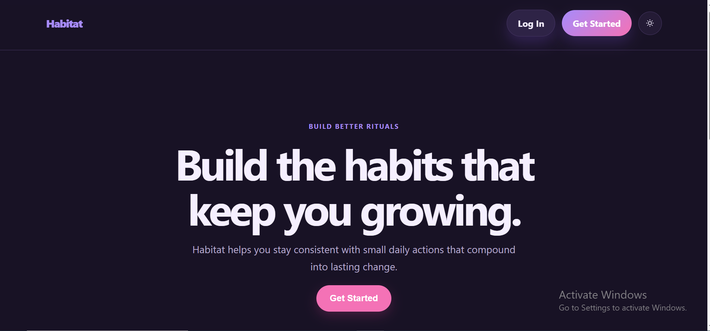
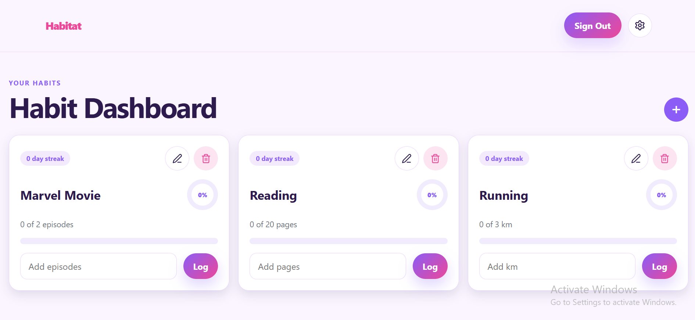
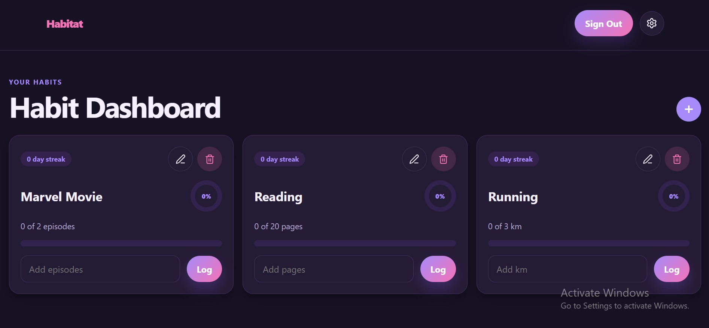

# 🌱 Habitat

Habitat is a calm, minimalist habit tracker designed to help users build consistent routines one day at a time. It focuses on simple progress tracking, thoughtful reflections, and a distraction-free interface with support for light and dark themes.

## ✨ Features

- 🔐 Secure user authentication with Supabase
- ➕ Create, edit, and delete habits
- 📈 Log daily habit progress
- 🎯 Visual progress rings and progress bars
- 🔥 Automatic streak calculation
- 📝 Add notes to daily habit logs
- 🌙 Light and dark theme support
- ⚙️ Account settings with password update
- 🗑️ Confirmation modal before deleting habits
- 📱 Responsive design for desktop and mobile
- 📧 Email verification
- 💬 Password reset

---

## 📸 Screenshots
### Landing Page



### Dashboard



### Dark Mode




---

## 🛠️ Tech Stack

### Frontend

- React
- React Router
- CSS Modules
- Vite

### Backend

- Supabase Authentication
- Supabase Database
- Row Level Security (RLS)

---

## 📂 Project Structure

```
src
├── components
│   ├── Auth
│   ├── Dashboard
│   ├── Landing
│   ├── Modal
│   ├── Navigation
│   └── Settings
│
├── context
│   ├── AuthContext.jsx
│   ├── ThemeContext.jsx
│   ├── useAuth.js
│   └── useTheme.js
│
├── hooks
│
├── lib
│   └── supabaseClient.js
│
├── utils
│
└── App.jsx
```

---

## 🚀 Getting Started

### Clone the repository

```bash
git clone https://github.com/lydiahmbugua/habitat.git
```

Navigate into the project:

```bash
cd habitat
```

Install dependencies:

```bash
npm install
```

Create a `.env` file in the project root:

```env
VITE_SUPABASE_URL=your_project_url
VITE_SUPABASE_ANON_KEY=your_anon_key
```

Start the development server:

```bash
npm run dev
```

---

## 🗄️ Database

Habitat uses two primary tables:

### habits

| Column | Type |
|---------|------|
| id | uuid |
| user_id | uuid |
| name | text |
| unit | text |
| target | numeric |
| created_at | timestamptz |

### habit_logs

| Column | Type |
|---------|------|
| id | uuid |
| habit_id | uuid |
| date | date |
| amount | numeric |
| note | text |

Both tables are protected using Supabase Row Level Security so users can only access their own data.

---

## 🎨 Design Philosophy

Habitat was designed around the idea of **calm productivity**.

Instead of overwhelming users with analytics and charts, it emphasizes:

- gentle progress
- consistency over perfection
- thoughtful reflection
- clean, distraction-free design

The interface uses soft colors, rounded components, and subtle animations to create a peaceful experience.

---

## 🔮 Future Improvements


- Habit categories
- Weekly and monthly analytics
- Habit reminders
- Calendar view
- User profile customization
- Export habit history
- PWA support
- Drag-and-drop habit ordering

---

## 👩🏽‍💻 Author

**Lydiah Mbugua**

GitHub: https://github.com/lydiahmbugua

LinkedIn: *(Add your LinkedIn URL here)*

---

## 📄 License

This project is licensed under the MIT License.
